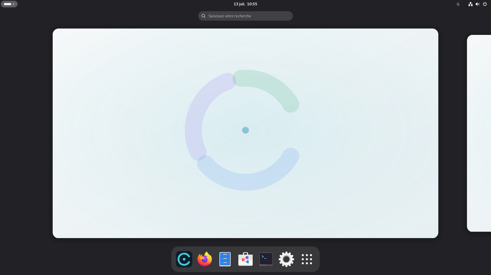
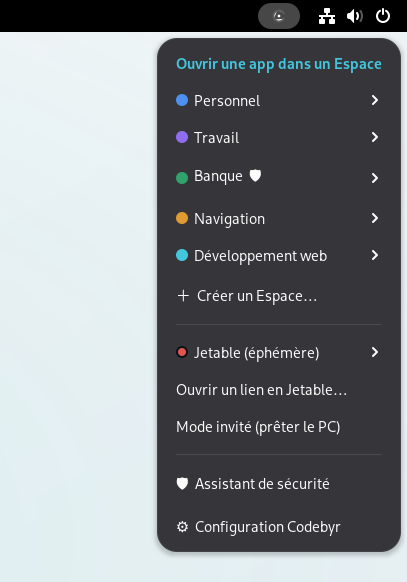
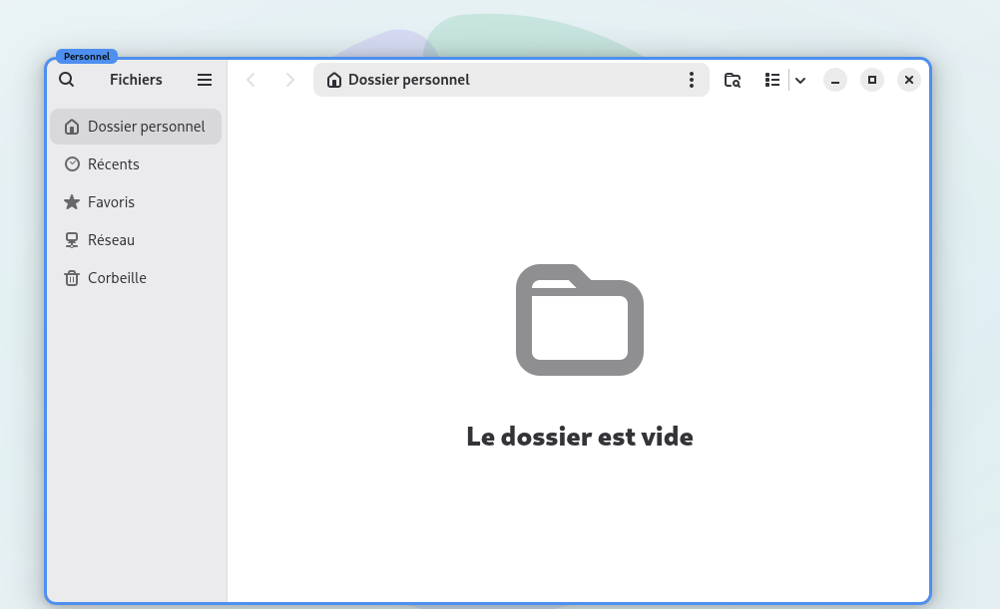
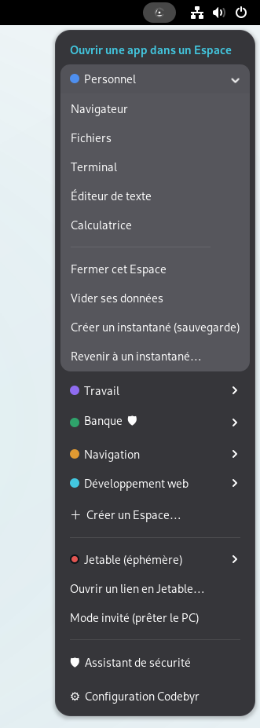
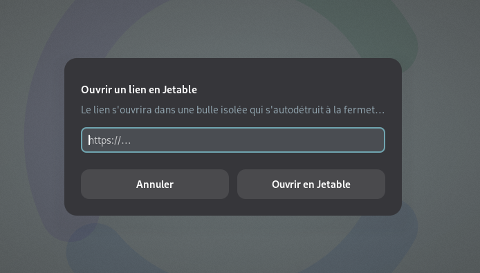
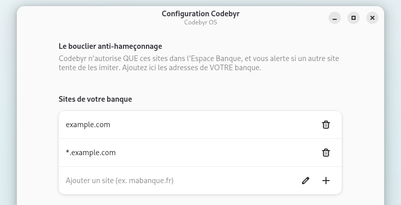
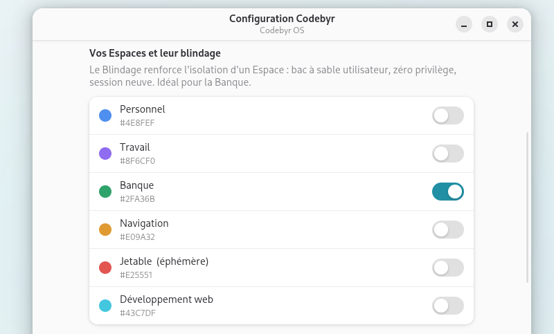
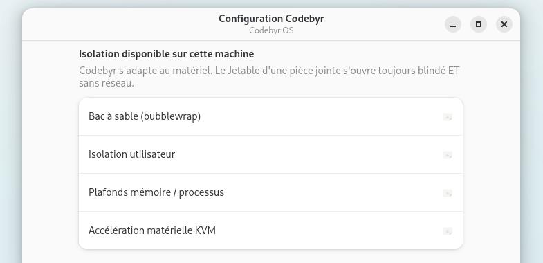
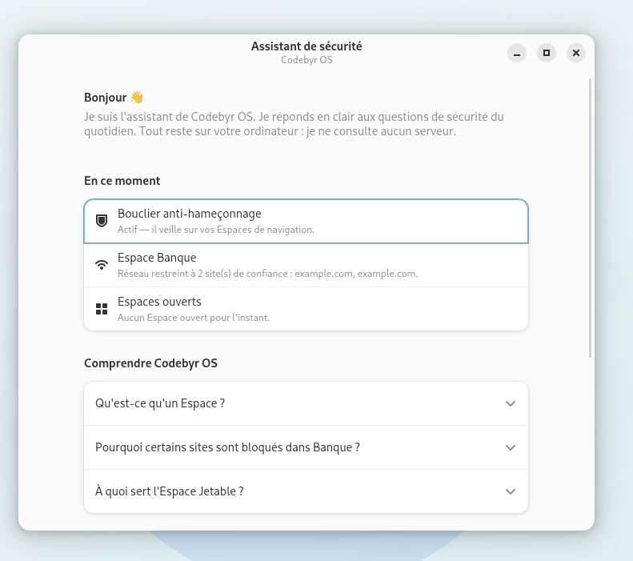

# Codebyr OS

> **Sécurisé par conception. Simple par conviction.**

**🌐 Site officiel : [os.codebyr.dev](https://os.codebyr.dev)**

Codebyr OS est une distribution Linux basée sur Debian qui apporte la sécurité par
compartimentation — l'idée fondatrice de Qubes OS — à tous les utilisateurs, sans
matériel d'exception ni expertise technique. En français d'abord, gratuite,
open source (GPL-3.0).

**État du projet : ISO live installable et fonctionnelle** — construite, testée et
installée sur machine réelle. Voir la [feuille de route](#feuille-de-route).



## Le concept : les Espaces

Là où Qubes parle de « qubes », de « domaines » et de « VM templates », Codebyr OS
parle d'**Espaces** : des compartiments isolés, avec des noms humains et une
couleur propre. Chaque fenêtre porte un liseré à la couleur de son Espace —
l'utilisateur n'a jamais besoin de savoir ce qu'est un conteneur : la couleur dit tout.

| Espace | Couleur | Usage |
|---|---|---|
| Personnel | Azur | Vie quotidienne, fichiers personnels |
| Travail | Améthyste | Documents et outils professionnels |
| Banque | Émeraude | Uniquement VOS sites financiers, rien d'autre n'y entre |
| Navigation | Ambre | Le web ordinaire, isolé du reste |
| Jetable | Braise | Éphémère — s'autodétruit à la fermeture |

Et vous pouvez créer vos propres Espaces persistants (nom + couleur) en deux clics
depuis le menu du Sceau.

<table>
  <tr>
    <td width="50%"></td>
    <td width="50%"></td>
  </tr>
  <tr>
    <td align="center"><em>Le menu du Sceau : ouvrir une app dans l'Espace de son choix.</em></td>
    <td align="center"><em>Chaque fenêtre porte le liseré de son Espace. La couleur dit tout.</em></td>
  </tr>
</table>

## Ce qui fonctionne aujourd'hui

- **Espaces isolés** : bac à sable bubblewrap, dossier personnel séparé, bus D-Bus
  privé, liserés colorés par fenêtre (extension GNOME Shell dédiée).
- **Le Blindage** : niveau d'isolation renforcé par Espace — espace de noms
  utilisateur, zéro privilège (`--cap-drop ALL`), session neuve, plafonds
  mémoire/processus (anti fork-bomb). Actif par défaut sur Banque.
- **Jetable automatique** : clic droit → « Ouvrir en Jetable ». Une pièce jointe
  douteuse s'ouvre dans une bulle **blindée et sans réseau** (namespace réseau
  isolé : le piège ne peut rien exfiltrer) ; un lien douteux s'ouvre dans une
  bulle **blindée** qui s'autodétruit — le réseau y reste ouvert, il est
  nécessaire pour charger la page.
- **Bouclier anti-hameçonnage** : le navigateur de l'Espace Banque n'atteint QUE
  vos domaines bancaires (proxy local à liste blanche — un garde-fou contre
  l'erreur humaine, pas une règle réseau système : voir SECURITY.md) ; dans les
  autres Espaces, une extension Firefox alerte si un site imite l'un de vos
  sites protégés.
- **Réseau par Espace** : libre, liste blanche (appliquée au navigateur de
  l'Espace), ou coupure totale (namespace réseau isolé, comme le Jetable
  fichier).
- **Retour dans le temps** : instantanés d'un Espace (export/import), restauration
  en un clic depuis le menu du Sceau.
- **Espace portable** : exportez un Espace complet, réimportez-le ailleurs.
- **Mode invité** : session vierge, nettoyée automatiquement à la déconnexion.
- **Assistant de sécurité** : réponses claires, en français, aux questions de
  sécurité du quotidien — 100 % local, aucune donnée n'en sort.
- **Configuration Codebyr** : vos vrais domaines bancaires, le blindage par
  Espace, et un rapport honnête des capacités d'isolation de votre machine
  (`codebyr-space isolation`).
- **Installeur graphique** Calamares aux couleurs Codebyr : partitionnement
  assisté ou manuel, chiffrement LUKS optionnel, nettoyage automatique des
  artefacts de session live.
- **Multilingue** : français par défaut, ~150 locales disponibles, polices
  Noto (latin, CJK, emoji). Clavier AZERTY par défaut.
- **Tour de bienvenue** au premier démarrage.

## Codebyr OS en images

<table>
  <tr>
    <td width="50%"></td>
    <td width="50%"></td>
  </tr>
  <tr>
    <td align="center"><em>Les applications et actions d'un Espace, d'un clic.</em></td>
    <td align="center"><em>Ouvrir un lien douteux dans une bulle jetable blindée, qui s'autodétruit.</em></td>
  </tr>
  <tr>
    <td width="50%"></td>
    <td width="50%"></td>
  </tr>
  <tr>
    <td align="center"><em>Le bouclier anti-hameçonnage : vos vraies banques, rien d'autre.</em></td>
    <td align="center"><em>Le Blindage, réglable Espace par Espace.</em></td>
  </tr>
  <tr>
    <td width="50%"></td>
    <td width="50%"></td>
  </tr>
  <tr>
    <td align="center"><em>Un rapport honnête de ce que votre machine sait faire.</em></td>
    <td align="center"><em>L'Assistant de sécurité : des réponses claires, 100 % local.</em></td>
  </tr>
</table>

## Honnêteté sur le modèle de sécurité

Codebyr OS **réduit drastiquement les dégâts** d'un piège (fichier vérolé, site
frauduleux, téléchargement douteux) en l'enfermant dans un compartiment jetable ou
blindé. C'est une protection réelle, mais **ce n'est pas Qubes** : l'isolation
repose sur les espaces de noms du noyau Linux (bubblewrap), pas sur des machines
virtuelles matérielles. Un exploit noyau peut théoriquement en sortir.

La détection des capacités est transparente : `codebyr-space isolation` vous dit
exactement ce que votre machine sait faire. Le support micro-VM (KVM) est le
prochain palier de la feuille de route pour les machines qui le permettent.

Vulnérabilité à signaler ? Voir [SECURITY.md](SECURITY.md).

## Construire l'ISO

Prérequis : un système Debian/Ubuntu (ou WSL2) avec `live-build`.

```bash
# 1) Environnement (une fois) — voir live-build/scripts/provision-wsl.sh pour WSL2
sudo apt install live-build rsync librsvg2-bin

# 2) Construction (root requis, filesystem Linux natif requis)
export CODEBYR_REPO=/chemin/vers/ce/depot
sudo -E bash live-build/scripts/build.sh
# → dist/codebyr-os-<version>-<date>-amd64.iso
```

Le build recopie la configuration vers `/var/tmp/codebyr-build` (jamais de build
sur un montage Windows/9p), télécharge les paquets Debian trixie, applique les
hooks de branding/durcissement, et rapatrie l'ISO dans `dist/`.

## Configuration requise

Codebyr fait tourner plusieurs Espaces isolés (chacun avec ses applications) :
la RAM est donc le facteur le plus important.

| | Minimum (usage léger) | Recommandé (confort) |
|---|---|---|
| Processeur | 64 bits (x86-64), 2 cœurs | 4 cœurs récents |
| **RAM** | **4 Go** (1-2 Espaces à la fois) | **8 Go** (plusieurs Espaces) |
| Disque | 20 Go libres | 30 Go+, SSD conseillé |
| Carte graphique | Intel/AMD/NVIDIA avec OpenGL (depuis ~2012) | idem |
| Démarrage | UEFI **ou** BIOS | UEFI |
| Installation | une clé USB de 2 Go+ | idem |

Notes :
- **Architecture x86-64 uniquement** pour l'instant (pas d'ARM / Raspberry Pi /
  Apple Silicon).
- La virtualisation matérielle (VT-x/AMD-V) n'est **pas** requise — l'isolation
  repose sur le noyau. Elle servira au futur socle micro-VM.
- Codebyr redonne vie à un portable modeste (un laptop de 2015 avec 8 Go tourne
  très bien), là où Qubes exige 16 Go et du matériel haut de gamme.

## Essayer / installer

1. Écrivez l'ISO sur une clé USB (Rufus, balenaEtcher, `dd`).
2. Démarrez dessus : session live immédiate (aucune installation forcée).
3. Pour installer : bouton **« Installer Codebyr OS sur ce disque »** à la fin du
   tour de bienvenue, ou l'application « Installer Codebyr OS ».

## Vérifier votre téléchargement (recommandé)

Chaque version est **signée avec la clé GPG du projet**. Vérifiez l'intégrité ET
l'authenticité de votre ISO :

```bash
# 1) Importer la clé publique Codebyr (une seule fois)
gpg --import codebyr-signing-key.asc      # depuis le dépôt

# 2) Vérifier la signature du fichier d'empreintes
gpg --verify SHA256SUMS.asc SHA256SUMS
#   → doit afficher : Good signature from "Codebyr OS ... "

# 3) Vérifier l'empreinte de l'ISO
sha256sum -c SHA256SUMS
#   → doit afficher : ...amd64.iso : Réussi
```

Empreinte de la clé de signature :
`E6FB 6616 EC58 E15F 40DA  876C B1E8 C803 CE59 6E68`.
Si la signature n'est pas « Good » / « valide », **n'utilisez pas l'ISO**.

## Structure du dépôt

```
codebyros/
├── README.md · LICENSE · CONTRIBUTING.md · SECURITY.md
├── docs/architecture.md          Architecture technique
├── branding/                     Charte graphique, logos, fonds d'écran
└── live-build/
    ├── auto/config               Configuration live-build (Debian trixie)
    ├── scripts/build.sh          Construction de l'ISO
    ├── config/package-lists/     Paquets embarqués
    ├── config/hooks/normal/      Branding, durcissement, session live, installeur…
    └── config/includes.chroot_after_packages/
        ├── usr/bin/codebyr-*     Les outils Codebyr (Python/sh)
        ├── usr/share/gnome-shell/extensions/codebyr@codebyr.io/
        │                         Extension GNOME (menu Sceau, liserés, Espaces)
        ├── usr/share/codebyr/antiphishing/   Bouclier navigateur
        ├── etc/codebyr/espaces.json          Registre des Espaces par défaut
        └── etc/calamares/        Installeur habillé Codebyr
```

## Feuille de route

- [x] **Phase 0 — Identité** : branding complet, charte, architecture
- [x] **Phase 1 — ISO de base** : Debian trixie + GNOME, durcie, débrandée, AZERTY
- [x] **Phase 2 — Les Espaces** : isolation bubblewrap, liserés, menu du Sceau
- [x] **Phase 3 — Les 7 fonctionnalités** : Jetable, Bouclier, Réseau par Espace,
      Portable, Retour dans le temps, Assistant, Mode invité — plus le Blindage
- [x] **Phase 4 — Installeur** : Calamares Codebyr, installation vérifiée sur
      machine réelle
- [ ] **Phase 5 — Diffusion** : ISO signées, CI de build, site, premiers testeurs
- [ ] **Phase 6 — Micro-VM** : isolation matérielle KVM pour les Espaces sensibles

## Contribuer

Les contributions sont bienvenues — voir [CONTRIBUTING.md](CONTRIBUTING.md)
(environnement de build, conventions, protocole de test).

## Licence

[GPL-3.0](LICENSE) — © Contributeurs Codebyr OS.
Basé sur [Debian](https://www.debian.org/) ; installeur
[Calamares](https://calamares.io/).
